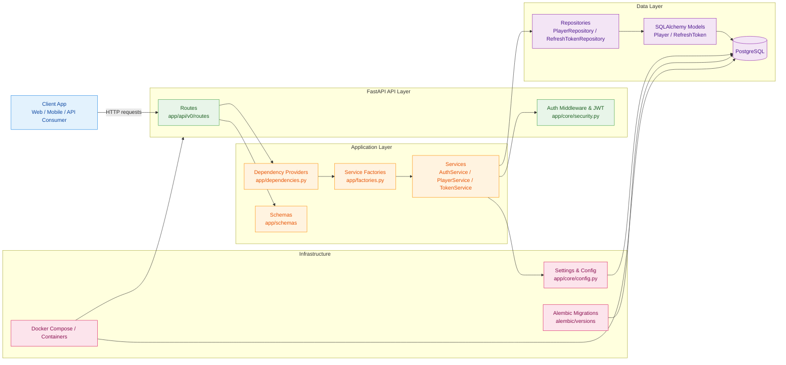

# Authentication Service Architecture

## Overview

This service is a FastAPI authentication backend for the codename_rats platform. It handles guest login, user registration, JWT access/refresh token creation, account linking, and logout flows.

## Layers

- API layer: route handlers under app/api/v0/routes
- Service layer: business logic in app/services
- Repository layer: database access in app/repositories
- Model layer: SQLAlchemy persistence models in app/db/models
- Core layer: settings, JWT helpers, and exception handling in app/core
- Infrastructure layer: PostgreSQL, Docker, and Alembic migration tooling

## Request flow

1. A client calls an endpoint like /v0/auth/login or /v0/auth/refresh-token.
2. The route resolves the required service dependency.
3. The service validates credentials and issues or revokes tokens.
4. Repositories read/write player and refresh-token records.
5. The PostgreSQL database persists the resulting state.
6. Alembic migrations keep schema changes consistent across environments.

## Main responsibilities

- Guest account creation and login
- Email/password registration and login
- Access token validation and refresh token rotation
- Token revocation during logout
- Account linking from guest to registered user
- Health monitoring via /v0/health
